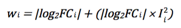

# Pipeline for integrative analysis of transcriptomics data

The pipeline starts with raw signal intensity files for microarrays and raw or read-count files for RNA-seq platforms. It contains four main stages: *quality control (QC)*, *pre-processing*, *summarisation* and *integrative analysis*. The workflow annotated with algorithms applied at individual steps is presented below:

 
 

### Suported platforms for data pre-processing

Scripts for pre-processing steps support the following platforms:
- Illumina sequencign platforms (e.g. Illumina Genome Analyzer® II, Illumina HiSeq® 2000)
- Affymetrix GeneChip® Human Exon (HuEx) 1.0 ST Array (~306,000 transcripts)
- Affymetrix GeneChip® Human Genome (HG) Array U133 Plus 2.0 (~47,000 transcripts)
- Affymetrix GeneChip® Human Genome (HG) Array U133A 2.0 (~18,000 transcripts)
- Affymetrix GeneChip® Human Genome (HG) Array U133A (~20,000 transcripts)
- Affymetrix GeneChip® Human Genome (HG) Array U133B (~20,000 transcripts)
- Affymetrix GeneChip® Human Genome (HG) Array U95Av2 (~10,000 transcripts)
- Affymetrix GeneChip® Human Genome (HG) Array U95B (~10,000 transcripts)
- Affymetrix GeneChip® Human Genome (HG) Array U95C (~10,000 transcripts)
- Illumina HumanHT-12® V3.0 Expression Beadchip (~43,000 transcripts)
 
 

### Integrative transcriptomics analysis scheme

The scripts and their execution commands used in each step in the **closed-platform** (microarrays) and **open-platform** (RNA-seq) data analysis are presented below:

 
 

The scripts for automated retrieval of data from ArrayExpress, GEO and SRA are located in [data_retrieval](https://github.com/JMarzec/data_retrieval/blob/master/README.md) repository.

 
 

# Methods

## Microarray data processing

### Quality control

The quality of individual datasets is assessed separately using *[Aroma.affymetrix](http://www.aroma-project.org)* R package for Affymetrix exon arrays and *[arrayQualityMetrics](https://bioconductor.org/packages/release/bioc/html/arrayQualityMetrics.html)* as well as *[simpleaffy](https://www.bioconductor.org/packages/release/bioc/html/simpleaffy.html)* Bioconductor packages for 3’IVT Affymetrix and Illumina microarrays. *[ArrayQualityMetrics](https://bioconductor.org/packages/release/bioc/html/arrayQualityMetrics.html)* package handles most current microarray technologies and is useful for automated analysis pipelines and for automatic QC report generation. Additionally, *[simpleaffy](https://www.bioconductor.org/packages/release/bioc/html/simpleaffy.html)* provides access to a variety of Affymetrix QC metrics to assess the integrity of RNA samples and the intermediate stages of sample preparation and hybridisation. Aberrant arrays are identified by means of *[arrayMvout](https://www.bioconductor.org/packages/release/bioc/html/arrayMvout.html)* multivariate outlier detection tool implemented in Bioconductor project.

Script | Description
------------ | ------------
[QC_Affy_[*platform*].R](https://github.com/JMarzec/transcriptomics_data_integration/blob/master/QC_Affy_U133Plus2.R) | Quality control of data from Affymetrix platforms
[QC_Illum_HT_12_V3.R](https://github.com/JMarzec/transcriptomics_data_integration/blob/master/QC_Illum_HT_12_V3.R) | Quality control of data from Illumina platform
 

### Probes filtering

Approach for cross-referencing probes from different microarray platforms implemented in this pipeline is based on the underlying probe sequence, wherein the sequence of each feature is annotated based on its alignment to the genome or transcriptome.

Probe sequence alignments and annotation with individual genes available within the *[Ensembl](http://www.ensembl.org/index.html)* database (release 87, December 2016, human genome build GRCh38) are retrieved using Perl *Application Programme Interface* (*API*). In order to increase cross-platform concordance, probes with low specificity are identified, hereafter called unreliable probes, and discarded prior to downstream analysis. For Affymetrix HG U133 Plus 2.0, U133A 2.0, U133A, U133B, U95Av2, U95B and U95C arrays, only probesets composed of not more than two probes with either mismatch, insertion, deletion, or mapping to none or more than one gene were retained. Moreover, Affymetrix probesets comprising probes mapping to different genes are excluded. For downstream analysis of data from Illumina array, only probes with perfect match and mapping to exactly one gene are kept.

Script | Description
------------ | ------------
[ArrayAnnot.pl](https://github.com/JMarzec/transcriptomics_data_integration/blob/master/ArrayAnnot.pl) | Annotate probes based on Ensembl mapping
[ProbeFilter.pl](https://github.com/JMarzec/transcriptomics_data_integration/blob/master/ProbeFilter.pl) | Filter out unreliable probes
 

### Normalisation and summarisation

Gene expression data obtained from the same array platform are normalised collectively to minimise batch effects, using only expression measurements determined by probes with sufficient specificity. Affymetrix multiple probe-level measurements derived from 3’IVT and exon arrays are aggregated into single target-level values and normalised across samples using *Guanine Cytosine Robust Multi-Array Analysis* (*GC-RMA*) approach implemented in *[gcrma()](https://www.bioconductor.org/packages/release/bioc/html/gcrma.html)* and *[GcRmaBackgroundCorrection()](https://www.rdocumentation.org/packages/aroma.affymetrix/versions/1.5.0/topics/GcRmaBackgroundCorrection)* R functions, respectively. Illumina probe-level measurements are normalised using *[robust spline normalisation](http://bioconductor.org/packages/release/bioc/html/lumi.html)* (*RSN*) algorithm.

In order to resolve the issue of “many-to-many” relationships between probes and genes, and to unify microarray probe and sequencing read annotations across platforms, multiple probes mapping to the same gene are further condensed to build “one-probe-to-one-gene” relations. This is achieved by selecting probes (Illumina) or probesets (Affymetrix) with the *highest standard deviation* across samples.

Script | Description
------------ | ------------
[GenExpressionComb_Affy_[*platform*].R](https://github.com/JMarzec/transcriptomics_data_integration/blob/master/GenExpressionComb_Affy_U133Plus2.R) | Merge, normalise and aggregate Affymetrix data to single values per gene
[GenExpressionComb_Illum_HT_12_V3.R](https://github.com/JMarzec/transcriptomics_data_integration/blob/master/GenExpressionComb_Illum_HT_12_V3.R) | Merge, normalise and aggregate Illumina data to single values per gene
 

## RNA-seq data processing

### Quality control and pre-processing

The raw *FASTQ* files containing nucleotide sequence along with corresponding quality scores are initially examined using *[FastQC](https://www.bioinformatics.babraham.ac.uk/projects/fastqc)* quality control tool. *FastQC* provides a modular set of analyses, such as base quality distribution or GC-content, enabling the detection of any problems in the sequencing data that may influence downstream analysis. Along with quantitative results, *[FastQC](https://www.bioinformatics.babraham.ac.uk/projects/fastqc)* generates graphical output that helps to identify the source of potential problem.
Subsequently, high-quality data are aligned to the GRCh38 reference genome using *[TopHat2](https://ccb.jhu.edu/software/tophat/index.shtml)* splice aligner, which implements *[Bowtie2](http://bowtie-bio.sourceforge.net/index.shtml)* algorithm as underlying mapping engine. Based on the alignment results, the quality of sequencing runs is further assessed with *htseq-qa* tool within *[HTSeq](http://www-huber.embl.de/HTSeq/doc/overview.html)* Python library.

The alignment results are summarised by matching read mappings against reference targets representing biologically meaningful expression units. As for the microarray probes summarisation process, the Ensembl gene set is used for the annotation, to ensure annotation compatibility between microarray probes and sequencing reads across various datasets and platforms. *[Htseq-count](http://www-huber.embl.de/HTSeq/doc/overview.html)* tool implemented in *[HTSeq](http://www-huber.embl.de/HTSeq/doc/overview.html)* Python library is applied to count the number of aligned reads that overlap with the individual gene’s coding region. The read count of four is set as a minimal threshold to estimate the genes’ expression. Three or less reads mapping to corresponding gene were deemed to be insufficient to accurately represent its expression and thus it was assumed to be not expressed.

Script | Description
------------ | ------------
[GenExpression_RNAseq.pl](https://github.com/JMarzec/transcriptomics_data_integration/blob/master/GenExpression_RNAseq.pl) | Aggregate reads into single count value per gene (*raw data only*)
[Get_gene_info.pl](https://github.com/JMarzec/transcriptomics_data_integration/blob/master/Get_gene_info.pl) | Retrieve genes’ length and GC content from Ensembl
 

### Normalisation

In this pipeline, the read-count data are subjected to *[conditional quantile normalisation](http://bioconductor.org/packages/release/bioc/html/cqn.html)* (*CQN*). This statistical methodology combines *robust generalised regression* to remove systematic bias introduced by deterministic features such as GC-content and gene length, and *quantile normalisation* to correct for global distortions. Additionally, a *voom()* normalisation function embedded within *[limma](http://bioconductor.org/packages/release/bioc/html/limma.html)* Bioconductor package is applied to log-transform the normalised read counts, estimate the mean-variance and to determine the weight of each observation for differential expression analysis.

Script | Description
------------ | ------------
[GenExpressionComb_RNAseq.pl](https://github.com/JMarzec/transcriptomics_data_integration/blob/master/GenExpressionComb_RNAseq.pl) | Merge datasets
[GenExpressionComb_RNAseq.R](https://github.com/JMarzec/transcriptomics_data_integration/blob/master/GenExpressionComb_RNAseq.R)  | Normalise datasets
 

## Data integration

### Batch effect assessment and data combination

*Principal component analysis* (*PCA*) is performed to identify key components of variability in the expression data derived from individual platforms. Additionally, the extent of biological and study effects is assessed by inspecting average similarities between samples from different studies but within the same biological group, and samples from the same study but representing different biological groups *[(Lukk et al. 2010)](https://www.ncbi.nlm.nih.gov/pubmed/20379172)*.

An *empirical Bayes* algorithm implemented in *[ComBat()](https://bioconductor.org/packages/release/bioc/html/sva.html)* R function is employed for identifying and removing batch effects from high-throughput expression data. It is superior to other procedures, particularly in case of high dimensional-data with small sample sizes, and is applicable to both microarray and RNA-seq data *([Johnson et al. 2007](https://www.ncbi.nlm.nih.gov/pubmed/16632515), [Chen et al. 2011](https://www.ncbi.nlm.nih.gov/pubmed/21386892), [Müller et al. 2016](https://www.ncbi.nlm.nih.gov/pubmed/27272489))*. *[ComBat()](https://bioconductor.org/packages/release/bioc/html/sva.html)* is applied to detect and remove batch effects in cross-study data generated on the same platform. Once non-biological experimental variation across datasets is identified and removed, expression data derived from the same platform are merged into a single expression matrix, which is then used for differential expression analysis.

Script | Description
------------ | ------------
[Study_effect.R](https://github.com/JMarzec/transcriptomics_data_integration/blob/master/Study_effect.R) | Study effect assessment
 

### Differential expression analysis

Differential expression analyses are performed independently for batch effect-adjusted expression data derived from each platform. Initially, *non-specific gene filtering* is applied to reduce the dimensionality of the data. Genes with low expression level variability across samples are eliminated, as they were unlikely to provide information about the phenotype of interest. Ultimately, 3,000 genes, for the sparse platforms, and up to 10,000 genes, for the most comprehensive platforms, with the highest standard deviation across all samples are considered for downstream analyses. Subsequently, the *linear modelling* functions from *[limma](http://bioconductor.org/packages/release/bioc/html/limma.html)* Bioconductor package, primarily developed and optimised for microarray and latterly adapted for sequencing data, are used for differential expression analysis. It is recognised that the performance of the *[limma](http://bioconductor.org/packages/release/bioc/html/limma.html)* R package is comparable or superior in some respects when compared to algorithms specifically designed for RNA-seq data *([Seyednasrollah et al. 2015](https://www.ncbi.nlm.nih.gov/pubmed/24300110), [Rapaport et al. 2013](https://www.ncbi.nlm.nih.gov/pubmed/24020486), [Soneson and Delorenzi 2013](https://www.ncbi.nlm.nih.gov/pubmed/23497356))*. For each platform, the expression *fold-changes* (*FC*) and *P values* are computed for all genes. *P values* are adjusted for multiple testing using *Benjamini and Hochberg* (*BH*) method *([Benjamini and Hochberg 1995](https://www.jstor.org/stable/2346101?seq=1#page_scan_tab_contents))*.

Script | Description
------------ | ------------
[DiffExpression_closedPlatform.R](https://github.com/JMarzec/transcriptomics_data_integration/blob/master/DiffExpression_closedPlatform.R)  | Batch effect removal and differential expression analysis (microarrays)
[DiffExpression_openPlatform.R](https://github.com/JMarzec/transcriptomics_data_integration/blob/master/DiffExpression_openPlatform.R)  | Batch effect removal and differential expression analysis (RNA-seq)
 

### Integrative analysis

Two dominant factors are considered in developing the cross-platform integration model: (1) the reproducibility of gene expression measurements between the individual platforms and (2) the magnitude of expression changes between investigated biological groups. Accordingly, cross-platform data integration are performed in two steps. First, the cross-platform reproducibility are estimated for individual genes. Secondly, the *P values* computed for individual platforms are combined using the *weighted Stouffer’s method* *([Rosenthal 1979](http://citeseerx.ist.psu.edu/viewdoc/download?doi=10.1.1.900.2720&rep=rep1&type=pdf))*.
 
 

#### Cross-platform reproducibility estimation

The cross-platform reproducibility is estimated by calculating *integrative correlation coefficients* (*ICCs*) using functions embedded in *[MergeMaid](https://www.bioconductor.org/packages/release/bioc/html/MergeMaid.html)* Bioconductor package. Briefly, *ICC* is attributed to each gene by computing the *Pearson correlation* between that gene and all other genes across samples within each platform. These correlations are then compared across platforms. This approach is based on the assumption that consistency of gene co-expression patterns reflects the overall datasets conformity.

>Diagram illustrating calculation of *ICC* for gene *A* between two platforms. *Pearson correlation coefficients* (*r*) are first computed to measure the similarity of variation of that gene expression across samples profiled by platforms 1 and 2. The comparison of *Pearson’s r* values derived from each platform provides the *ICC* value, as shown on the scatterplot on the right-hand side. Each spot on this gene-specific integrative correlation plot corresponds to the correlations, measured in the two platforms, between the gene in question and one of the other genes present on both platforms.

 

#### Overall significance estimation with weighted Stouffer’s method

The overall significance level for each gene is estimated by combining per-platform *P values* using *Stouffer’s Z score* method. This method is based on converting individual *P values* for each gene into *Z scores*. The standard normal deviates are then summed across all platforms and divided by the square root of the number of platforms according to the following equation:

where *Zj* is the combined *Z score* for the *jth* gene and *k* is the number of platforms encompassing the corresponding gene. The advantage of *Stouffer’s Z score* method is that it can be easily extended to incorporate weights for individual platforms. The weighted form of Stouffer’s method was adapted by Mosteller and Bush *([Mosteller and Bush 1954](https://scholar.google.co.uk/citations?view_op=view_citation&hl=en&user=POvQVvkAAAAJ&cstart=400&pagesize=100&sortby=pubdate&citation_for_view=POvQVvkAAAAJ:Y0pCki6q_DkC))* and Liptak *([Liptak 1958](http://www.oalib.com/references/11350075))*, and defines the overall *Z score* according to the following equation:

where *wi* is the weighting factor for the *jth* gene for *ith* out of *k* platforms. Lastly, the combined *Z score* is converted into *P value* representing the overall level of significance for the corresponding gene.
A second important feature of *Stouffer’s* method is that it facilitates overall significance estimation for a diverse number of tests, therefore enabling the investigation of all genes present across various platforms. This eliminates the risk of losing information on genes present only on some of the platforms used for data integration.

In the proposed method *FC* values and *ICCs* are used as weighting factors to account for both the magnitude of change and cross-platform reproducibility, respectively. The following formula is applied to define a weighting score w for individual genes in *Stouffer’s* method:

 

>Plot illustrating the contribution of gene-specific *ICC* (x-axis) and *log2 FC value* (indicated by different colours) to the weighting score used for *Stouffer’s* method. According to proposed model, along with the increase of *ICC* the weighting score raises, with greater extend of the increment attributed to higher *log2 FC values*.

 
where *FC* and *I* indicate the *fold-change* value and the *ICC* for a given gene, respectively, as measured by *ith* platform.

Additionally, *integration-driven discovery rates* (*IDRs*) are computed to evaluate the impact of meta-analysis on the final results *([Choi et al. 2003](https://www.ncbi.nlm.nih.gov/pubmed/12855442))*. Briefly, *IDRs* estimate the fraction of significant genes detected in meta-analysis that is not detected in any of the individual platforms for a given significance threshold. Each *Z score* is calculated as the ratio of average effect size over its *standard error*, and represents the statistical significance of the differential expression across multiple experiments.

Script | Description
------------ | ------------
[Meta_analysis.R](https://github.com/JMarzec/transcriptomics_data_integration/blob/master/Meta_analysis.R) | Meta-analysis
 

### Cross-platform integrative analysis scheme

 
 

 >Diagram summarising the integrative analysis workflow including: (A) collection of multi-study expression data generated using different technologies and covering various set of genes, (B) combination of raw expression data derived from the same platform, (C) per-platform differential expression analysis followed by calculation of ICC for each gene and (D) application of the integrative analysis model, based on the weighted *Stouffer’s* algorithm, to determine the cross-platform gene ranking using combined P values.
